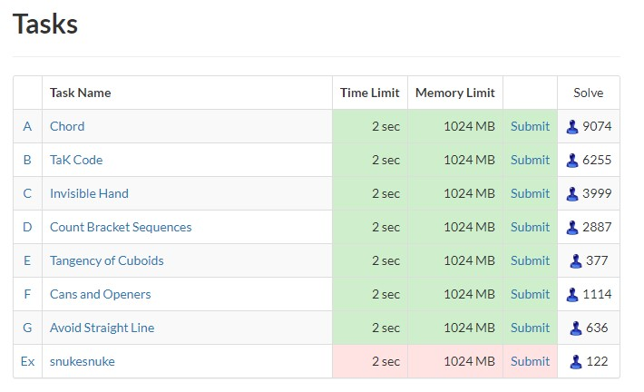

# Atcoder Task Extension

Atcoder lacks some useful features like solve count and status in the contest task page. I myself once submitted in the wrong problem once. Also one needs to visit standings to check solve counts. This chrome extension allows to do just that.

## Features

- Show solve count of problems
- Show AC and WA status of problems

## Features for future

- Add other judge status too, but ig that are not necessary

## How to add extension

- Download this repository as zip then unzip or clone to local.
- Then go to chrome [extension](chrome://extensions/) . => That three dot in top right => More tools =>Extensions
- Enable developer mode
- Click load unpacked button
- And then select the downloaded folder

## Problems
The load time is a bit slow

## Conclusion

If you love my work you can follow me or star this repo. Thank you